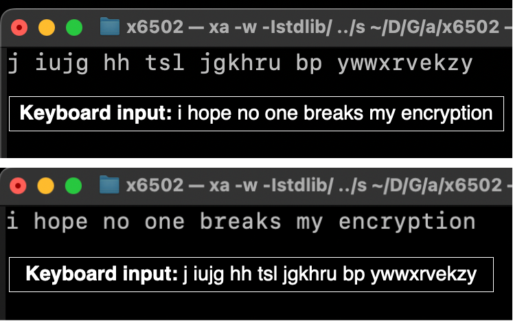

<h1 align="center">Assembly Enigma</h1>

<p align="center">An <a href="https://en.wikipedia.org/wiki/Enigma_machine">Enigma Machine</a> written in 6502 assembly</p>


# Examples



# Running

### Step 1: Install `xa`

Install for Mac here https://formulae.brew.sh/formula/xa

More info here https://www.floodgap.com/retrotech/xa/

### Step 2: Clone [x6502](https://github.com/haldean/x6502) (6502 emulator)

```sh
git clone https://github.com/haldean/x6502
```

### Step 3: Compile x6502

```sh
cd x6502
gcc -o x6502.bin -O3 -lpthread -Wall -lncurses -Werror -Wimplicit-function-declaration *.c
```

> ⚠️ You might get an error like `debug.c:2:10: fatal error: 'debug-names.h' file not found`. I solved it by commenting out the `dump_cpu` function in `x6502/debug.c` and line 2 with `#include "debug-names.h"`. You don't need this stuff to run the program (who needs debug functionality?)

### Step 4: Compile and run program

While being in `./x6502` run:

```sh
xa -w -Istdlib/ ../src/main.asm  && ./x6502 a.o65
```

> Tip: `^C` to exit program

### Bonus program (Caesar Cihper)

If you want to look at a more easily comprehensible program, there is a file called [`caesar-cipher.asm`](caesar-cipher.asm) in this repository.

```sh
xa -w -Istdlib/ ../caesar-cipher.asm  && ./x6502 a.o65
```

> Tip: Type `e` (as the first thing) to choose encryption or `d` to choose decryption

# License

This project is licensed under the MIT License - see the [LICENSE](LICENSE) file for details.
All images were created by me. Feel free to steal them (same goes for everything else of course).
